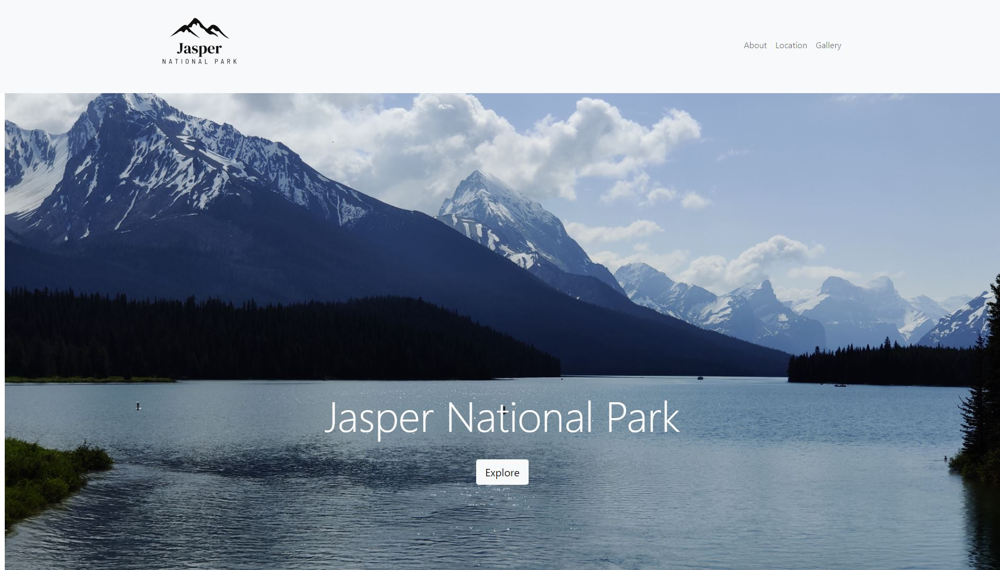
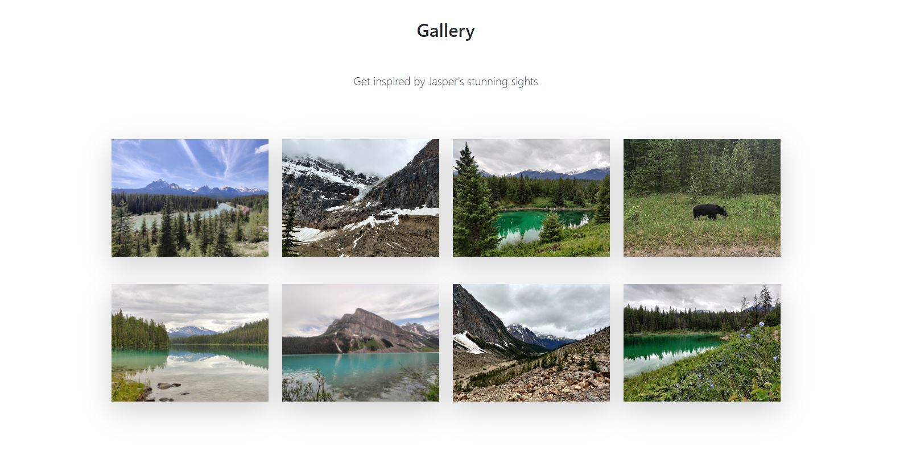

# National Park Website
> The purpose of this project was to practice using Bootstrap to create a 
website for a park.

## Table of Contents
* [General Info](#general-information)
* [Links](#links)
* [Technologies Used](#technologies-used)
* [Screenshots](#screenshots)
* [Project Status](#project-status)
* [Room for Improvement](#room-for-improvement)
* [Contact](#contact)

## General Information
The task for this project was to practice using Bootstrap. The following elements
were required as part of the task:

- Collapsable Navbar
- Hero Image
- "About" information
- a Map of the park with a description next to it
- a photo gallery
- Utilization of Bootstrap rows and column classes

## Links
- Live Demo URL: [https://marlisarebaum.github.io/park-website/](https://marlisarebaum.github.io/park-website/)

## Technologies Used

## Screenshots

#### Landing Page with Navigation Bar and Hero Image:

#### Image Gallery Created Using Bootstrap:

## Project Status
Project is:  _complete_ 

## Room for Improvement
While Boostrap was utilized in building this site and the navigation bar and image
gallery are fully responsive (which was the main objective of the project), the
rest of the site is not responsive. The following improvements could be made:
- The hero image text should decrease in size for smaller screens.
- The "about" section text should decrease on smaller screen sizes and move under
the "about" header.
- The map should decrease in size and move under the description on smaller screens.

## Contact
Created by [Marlisa Rebaum](https://www.linkedin.com/in/marlisarebaum/) - feel free to contact me!